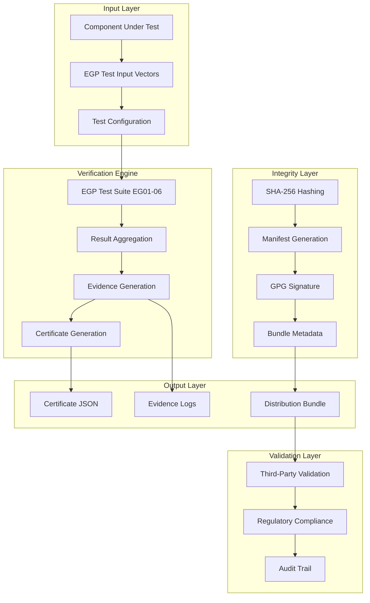
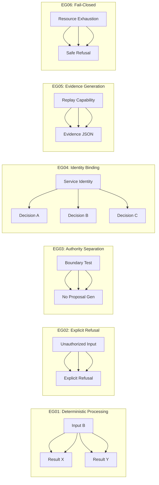
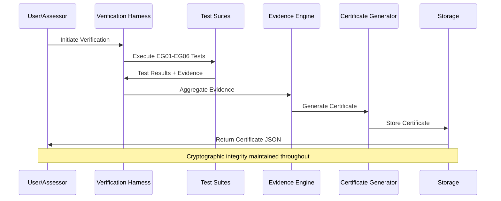
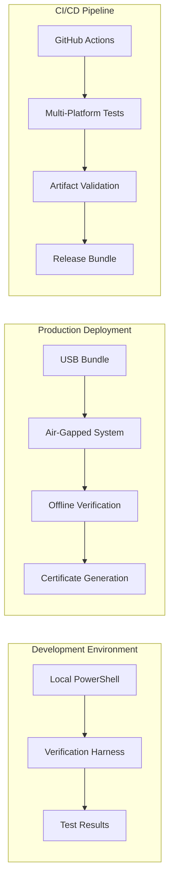
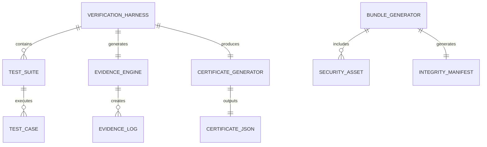
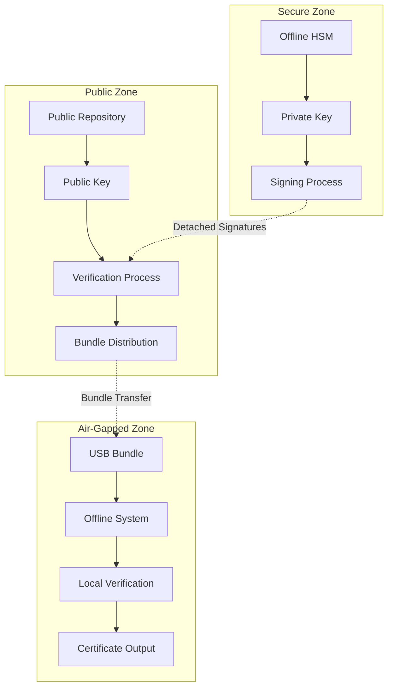
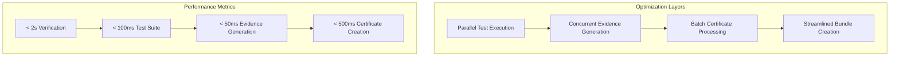
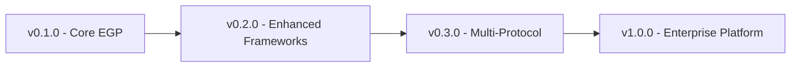

# NovaFuse-EGP-VS Architecture

## System Overview

**Scope Notice:** These diagrams describe verification, evidence-generation, and integrity architecture of NovaFuse-EGP-VS only. They do not represent deployment architectures of evaluated systems, do not imply regulatory approval, and do not confer certification authority.

## EGP Test Suite Architecture

## Data Flow Architecture

## Security Architecture

```mermaid
graph TB
    subgraph "Trust Chain"
        A[Offline HSM] -->|Private Key| B[GPG Signing]
        B --> C[Detached Signature]
        C --> D[Public Distribution]
    end
    
    subgraph "Integrity Verification"
        E[SHA-256 Manifest] --> F[Hash Verification]
        F --> G[Signature Verification]
        G --> H[Bundle Validation]
    end
    
    subgraph "Revocation Framework"
        I[Revocation Certificate] --> J[Revocation Manifest]
        J --> K[Automated Checking]
        K --> L[Fail-Closed Response]
    end
```

## Deployment Architecture

## Component Relationships

## Technology Stack

### Core Technologies
- **PowerShell 5.1+**: Primary execution environment
- **JSON Schema**: Certificate validation
- **SHA-256**: Cryptographic integrity
- **GPG**: Digital signatures
- **Python 3.8+**: Revocation checking

### Supporting Technologies
- **Docker**: Containerization
- **GitHub Actions**: CI/CD pipeline
- **Mermaid**: Architecture diagrams
- **Markdown**: Documentation

## Security Boundaries

## Performance Architecture

---

## Architecture Principles

### 1. **Deterministic Processing**
- Identical inputs always produce identical outputs
- No external dependencies during verification
- Reproducible across platforms and environments

### 2. **Fail-Closed Security**
- All failure conditions result in safe refusal
- No partial execution on errors
- Comprehensive error logging and evidence

### 3. **Cryptographic Integrity**
- SHA-256 hashing for all components
- GPG digital signatures for authenticity
- Complete audit trail with non-repudiation

### 4. **Regulatory Alignment**
- Direct mapping to major compliance frameworks
- Evidence generation for audit requirements
- Third-party validation protocols

### 5. **Portable Deployment**
- Self-contained verification system
- USB/offline distribution capability
- Cross-platform compatibility

---

## Evolution Path

### Current State: v0.1.0
- ✅ Complete EGP test suite implementation
- ✅ Cryptographic integrity verification
- ✅ USB distribution system
- ✅ Third-party validation protocols

### Next Steps
- Additional regulatory framework support
- Enhanced performance optimization
- Multi-protocol compliance verification
- Enterprise management interface
